<!-- ============ ANIMATED BANNER ============ -->

<!-- ============ ABOUT ============ -->
## About me

- Software Engineer at **[Critical TechWorks](https://www.criticaltechworks.com/)** — building software for the **BMW Group**
- Based in **Braga, Portugal**
- Currently going deeper into **software architecture**
- Ask me about **Java, Spring and React**

<!-- ============ TECH STACK ============ -->
<!-- EDIT ME: the stack lives in assets/tech-stack.svg, lines 137-157 -->
## Tech stack

<!--
  The github-readme-stats and github-profile-trophy widgets used to live here.
  Both run on shared free-tier Vercel instances that are currently returning
  503 / 402, so they render as broken images. The snake below is generated by
  our own GitHub Action and served from this repo, so it does not depend on
  anyone else's quota.
-->

<!-- ============ CONTRIBUTION SNAKE ============ -->
<!-- Generated by .github/workflows/snake.yml, which publishes to the `output` branch. -->

<!-- ============ CONTACT ============ -->
## Where to find me

