<!-- ============ ANIMATED BANNER ============ -->

 

<!-- ============ ABOUT ============ -->
## 👋 About me

- 💼 Software Engineer at **[Critical TechWorks](https://www.criticaltechworks.com/)** — building software for the **BMW Group**
- 📍 Based in **Braga, Portugal**
- 🌱 Currently going deeper into **software architecture**
- 💬 Ask me about **Java, Spring and React**
- ⚡ Fun fact: I enjoy over-engineering my own GitHub profile

<!-- ============ TECH STACK ============ -->
<!-- EDIT ME: swap these badges for your actual day-to-day stack -->
## 🛠️ Tech stack

<!-- ============ GITHUB STATS ============ -->
## 📊 GitHub stats

<!-- ============ TROPHIES ============ -->

<!-- ============ CONTRIBUTION SNAKE ============ -->
<!-- Generated by .github/workflows/snake.yml, which publishes to the `output` branch. -->

<!-- ============ CONTACT ============ -->
## 🌐 Where to find me

<!-- EDIT ME: point these at your real LinkedIn profile and preferred email -->

